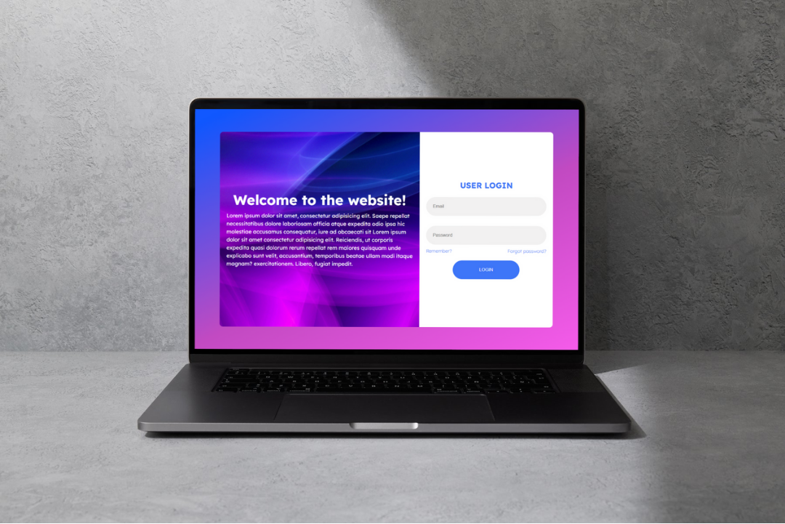

# Tela de Login - Vibrante

Uma tela de login com um design vibrante, moderno e pensado para atrair atenção visual. Ideal como base para interfaces de aplicações web.

## 🛠️ Tecnologias utilizadas

- HTML5
- CSS3
- Gradientes e animações simples

## ✨ Funcionalidades

- Layout centralizado
- Design colorido e atrativo
- Responsividade básica

## 📷 Preview

  

## 🎨 Design no Figma

🔗 [Ver no Figma](https://www.figma.com/design/mGcli16zoQzQKWcfcIJgeP/Untitled?node-id=0-1&t=59FjjsYAXtGI4xx5-1)

